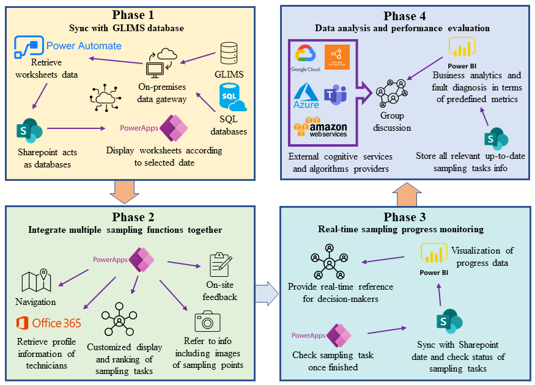
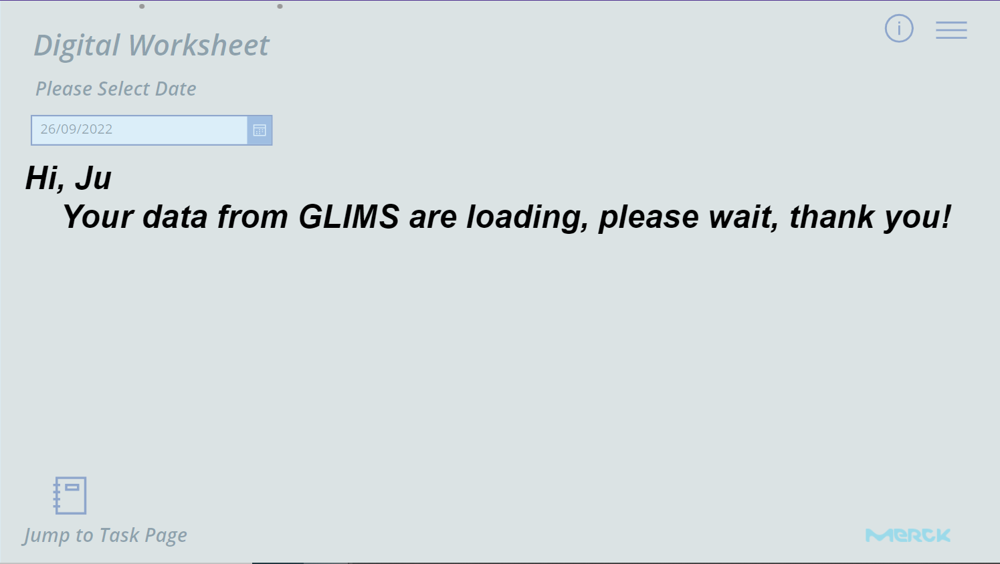
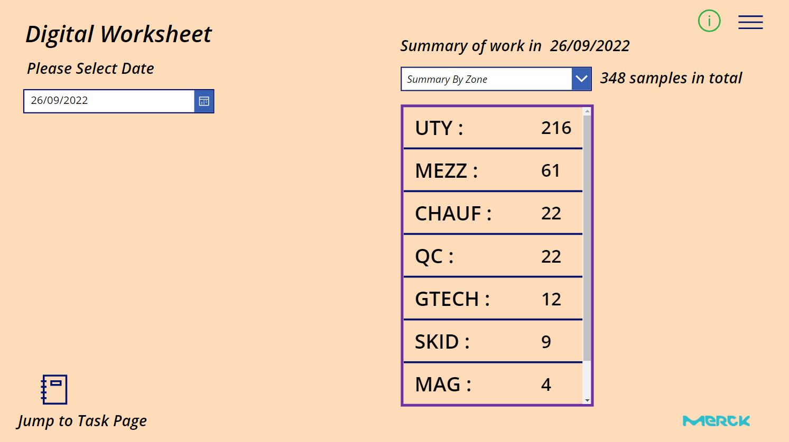
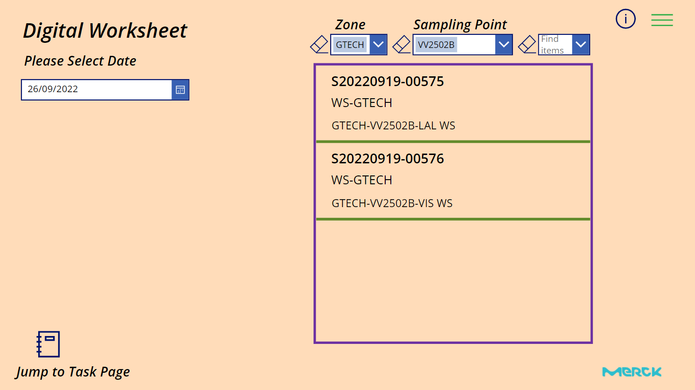
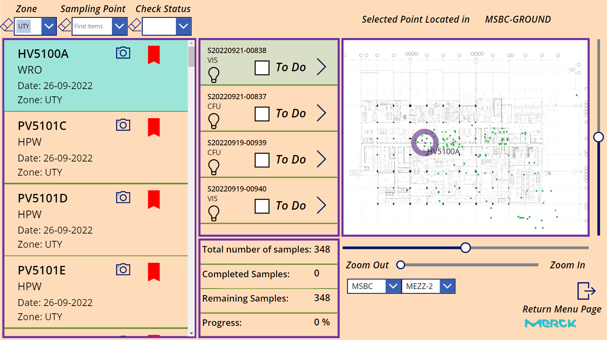
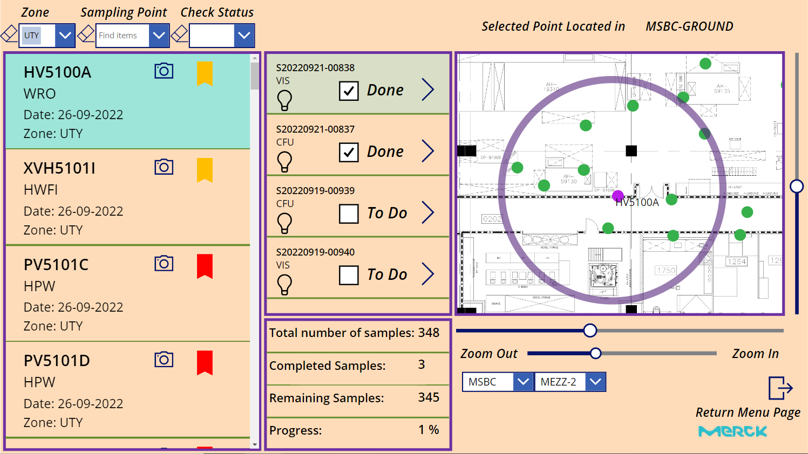
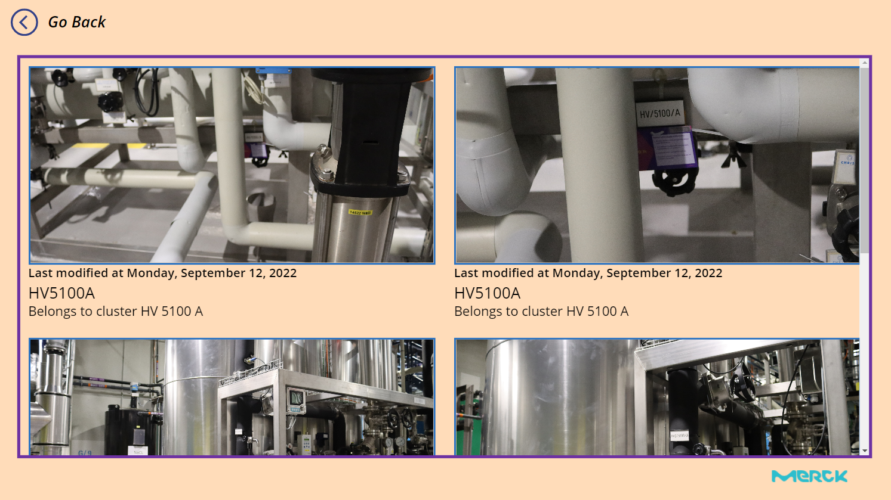

**Digital Sampling Assistant README**

---

### 📘 **Context**

The master thesis titled ***"Semantics-driven Digitalization Transformation Framework of Maintenance Strategies in the Pharmaceutical Industry"*** identifies challenges faced by the pharmaceutical industry in adopting digital transformations. One of the key challenges includes the integration of complex networks, ensuring regulatory compliance, and effectively coordinating digital resources.

This reluctance to digitalize stems from a lack of reference models that can help in transitioning legacy work models and organizational structures. Furthermore, the pharmaceutical industry's maintenance activities are paramount to ensure equipment functionality and, ultimately, product quality.

Our solution? Develop a semantics-driven digitalization transformation framework focusing on the pharmaceutical industry's maintenance strategies. This framework aims to ensure the continuity and cohesion of digital resources and technologies, improving efficiency and adaptability.

💼 Access the complete master thesis [here](https://drive.google.com/file/d/10l5wNSvn60pmQKvgVWk7Jz5fpkQK4wkz/view).

---

### 🌊 **Digital Sampling Assistant's Role**

**Positioned proudly in the "Workflow Automation Module" within the "Service Layer" of our revolutionary digitalization transformation framework**, the Digital Sampling Assistant is a practical implementation of this strategy. Our case study focused on supporting water sampling activities in the Merck Serono facility at Vevey. This digital assistant, as part of an ecosystem comprising platforms and software providing web-based services, automates workflows for water sampling activities, exemplifying how our framework addresses the problem spaces and adapts to specific enterprise use-cases.

---

#### 📈 **Overview**
#### Workflow overview of the digital sampling assistant

We've unified numerous water sampling processes into a single, slick, automated workflow. Imagine an ecosystem where software and platforms come together to offer web-based services for efficient water sampling. Want a bird's eye view? Feast your eyes on the below:
<!--
-->

#### 🖥️ **User Experience**

As technicians dive into the platform:

1. A friendly message pops up, ensuring they pause briefly for connection with GLIMS and subsequent data synchronization. 

2. By default, the worksheet data from the current day is fetched, refined, and showcased.

---

#### 🌟 **Main Features**

1. **Electronic Worksheets**: Intuitively view and rank sampling tasks along with related stats using features like "Sampling Zone", "Sampling Method", and more. Filter tasks based on these very features for a tailored experience.
<table>
  <tr>
    <td></td>
    <td></td>
  </tr>
  <tr>
    <td align="center">Snapshot of Electronic Worksheets</td>
    <td align="center">Filtering of Sampling Tasks</td>
  </tr>
</table>
2. **Interactive Digital Maps and Scene Pictures**: Navigate sampling zones marked with specific sampling points. Highlight, search, zoom in, and zoom out! Also, get a peek into the media related to a sample point with just a click.
<table>
  <tr>
    <td></td>
    <td></td>
    <td></td>
  </tr>
  <tr>
    <td align="center">Digital Maps and Sampling Points</td>
    <td align="center">Zooming Feature</td>
    <td align="center">Scene Images for Sampling Points</td>
  </tr>
</table>
3. **Sampling Task Check-ins & On-Site Feedback**: Give real-time feedback and check off tasks as they're completed. Log vital details, all of which seamlessly transfer to the connected Sharepoint List.

4. **Real-time Progress Monitoring and Predictive Maintenance**: All up-to-the-minute details about sampling tasks are centralized. Plus, with Power BI's deep integration, expect advanced algorithms for predictive maintenance. It's a hub of information ready to support various modules in our digitalization transformation framework for water sampling activities!

---

### 🎉 **Get Started** Setting Up the Digital Sampling Assistant
To make the most of the Digital Sampling Assistant, you'll need to load the MSAPP file. Here's a step-by-step guide to help you through the process:

#### 1. Install the On-Premise Data Gateway

Begin by installing the On-Premise Data Gateway. This is essential for the smooth operation of our system. You can download it directly from the Microsoft official website using the following link:

[On-Premise Data Gateway Installation](https://learn.microsoft.com/en-us/data-integration/gateway/service-gateway-install)

#### 2. Register Your Enterprise Domain Account

Once the gateway is installed, proceed to register using your personal enterprise domain account. This ensures the integrity and security of your connection.

#### 3. Set Up MS Power Automate Connector with SQL Database

Now, it's time to integrate with the SQL database, GLIMS:

- Create a new MS Power Automate connector.
- Use the On-Premise Data Gateway that you've just registered.
- Authenticate using the provided SQL account (details given below).

#### 4. Modify the MS Power Automate Flow

The final step is to adjust the MS Power Automate flow:

- Edit the flow to retrieve data from GLIMS. You'll want to change the source connector to the one you've just set up.
  
However, it's crucial to note that the pre-existing MS Power Automate flow for data retrieval may already be bound to a domain account. If that account gets deactivated, the associated flow might become ineffective. In such cases, you'll need to create a new MS Power Automate flow from scratch. This process can be a tad intricate, so ensure you're familiar with the tool.

---

**Note:** Ensure you have the necessary SQL account details at hand before beginning the setup.

---

**Happy Sampling! 💧**
